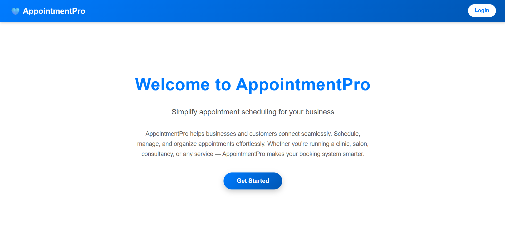
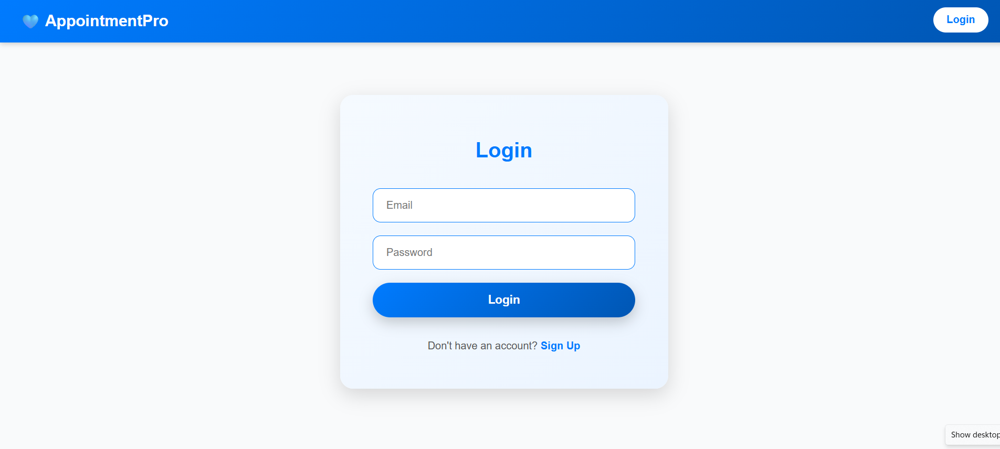

<h2 align="left">About the project :</h2>

###

Description :

###

AppointmentPro is a web-based appointment booking system where users can sign up and request appointments, and a single admin can approve or reject them. It features separate logins for users and admin, supporting multiple users but only one admin for centralized management.

###

Project Link :  https://appointment-booking-af98f.web.app/

###

Admin Login :

###

Email : admin@gmail.com Password : 123456

###

<h2 align="left">Languages and Tools Used :</h2>

###

  
  
  
  
  
  
  
  
  

###

<h2 align="left">IMAGES :</h2>

###

Home Page :

###

  

###

Login :

###

  

###

Sign Up :

###

  

###

User Page :

###

  

###

Admin Page :

###

  

###
